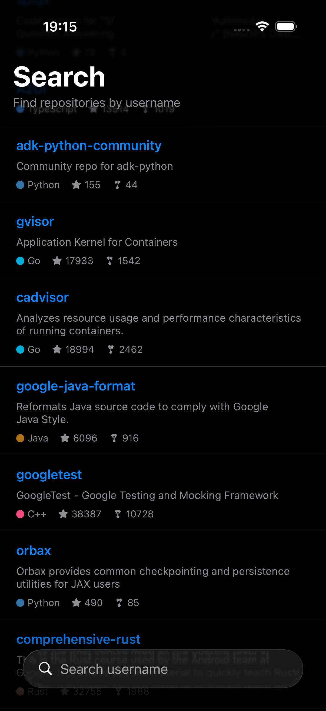
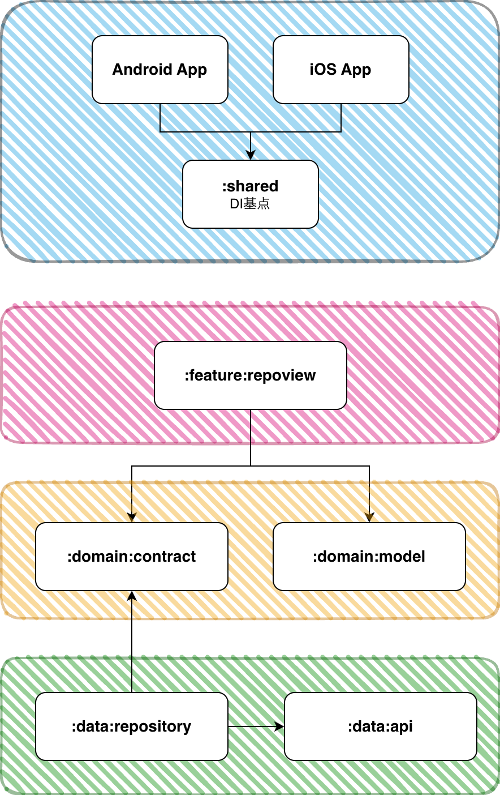

# GitHub Repo Browser

GitHubのユーザー名を入力して、そのユーザーのリポジトリ一覧を表示するアプリです。
Kotlin Multiplatform で構築し、iOS・Android それぞれネイティブ UI で動作します。

## スクリーンショット

| Android | iOS |
|:---:|:---:|
|  |  |

## 技術スタック

| レイヤー | 技術 |
|---|---|
| 共通ロジック | Kotlin Multiplatform |
| DI | metro (dev.zacsweers.metro) |
| 通信 | Ktor |
| JSON | kotlinx.serialization |
| 非同期 | kotlinx.coroutines |
| iOS Swift 連携 | SKIE |
| Android UI | Jetpack Compose |
| iOS UI | SwiftUI |
| 状態管理 | ViewModel (KMP) + StateFlow |

## プロジェクト構成

```
├── shared/              # DI グラフ定義
├── domain/
│   ├── model/           # データモデル
│   └── contract/        # DIP のためインターフェースを定義
├── data/
│   ├── api/             # API クライアント（Ktor）
│   └── repository/      # リポジトリ実装
├── feature/
│   └── repoview/        # ViewModel + UI 状態
├── androidApp/          # Android アプリ（Jetpack Compose）
└── iosApp/              # iOS アプリ（SwiftUI）
```

## モジュール依存関係



## ビルド方法

### Android

```shell
./gradlew :androidApp:assembleDebug
```

### iOS

```shell
./gradlew :shared:embedAndSignAppleFrameworkForXcode
```

または `iosApp/iosApp.xcodeproj` を Xcode で開いて Run。
