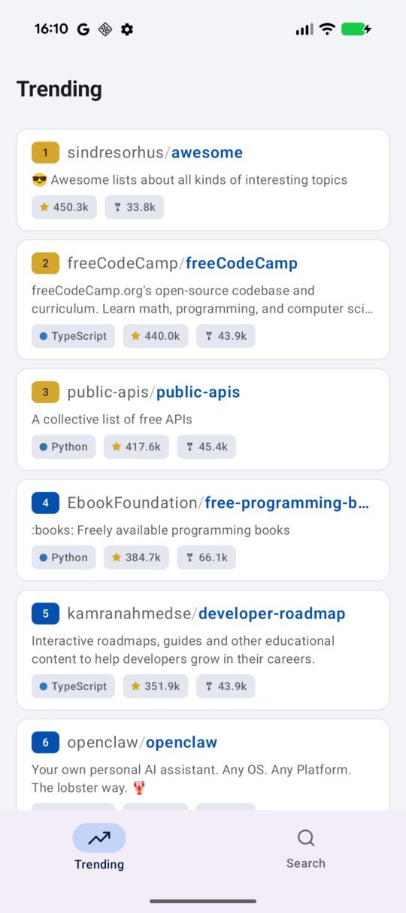
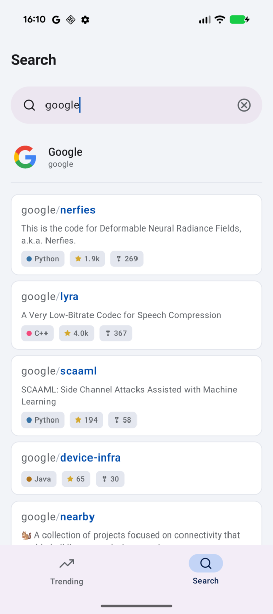
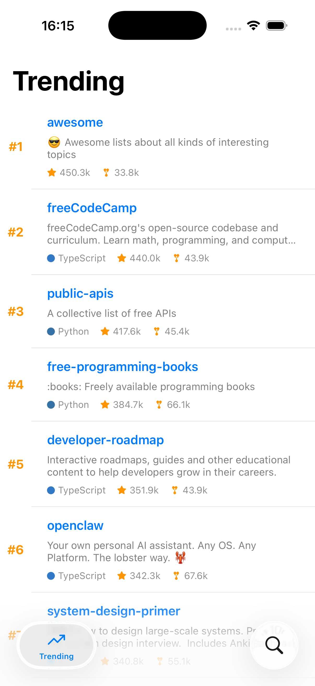
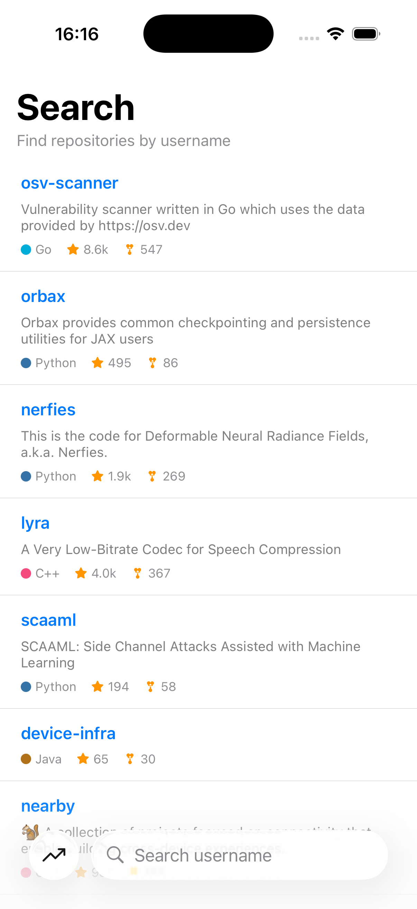

# GitHub Repo Browser

GitHubの活発なリポジトリを表示するアプリです。ユーザー名を入力して、そのユーザーのリポジトリ一覧を表示することもできます。

Kotlin Multiplatform で構築し、iOS・Android それぞれネイティブ UI で動作します。

## スクリーンショット

| トレンド画面 | 検索画面 |
|:---:|:---:|
|  |  |
|  |  |

## 技術スタック

| レイヤー | 技術 |
|---|---|
| 共通ロジック | [Kotlin Multiplatform](https://www.jetbrains.com/kotlin-multiplatform/) |
| DI | [metro](https://zacsweers.github.io/metro/) |
| 通信 | [Ktor](https://ktor.io/) |
| JSON | [kotlinx.serialization](https://github.com/Kotlin/kotlinx.serialization) |
| 非同期 | [kotlinx.coroutines](https://github.com/Kotlin/kotlinx.coroutines) |
| 多言語化 | [Moko Resources](https://github.com/icerockdev/moko-resources) |
| iOS Swift 連携 | [SKIE](https://skie.touchlab.co/) |
| Android UI | [Jetpack Compose](https://developer.android.com/compose) |
| iOS UI | [SwiftUI](https://developer.apple.com/jp/swiftui/) |
| 状態管理 | ViewModel (KMP版) + StateFlow |

## プロジェクト構成

```
├── shared/              # DI グラフ定義
├── domain/
│   ├── model/           # データモデル
│   └── contract/        # DIP のためインターフェースを定義
├── data/
│   ├── api/             # API クライアント（Ktor）
│   └── repository/      # リポジトリ実装
├── feature/
│   └── repoview/        # ViewModel + UI 状態
├── androidApp/          # Android アプリ（Jetpack Compose）
└── iosApp/              # iOS アプリ（SwiftUI）
```

## モジュール依存関係


## ビルド方法

### Android

```shell
./gradlew :androidApp:assembleDebug
```

### iOS

`iosApp/iosApp.xcodeproj` を Xcode で開いて Run。

#### 初回設定

Xcodeが使う Java が 21 となるようにする必要があります。必要に応じて `iosApp/.xcode.env.local` を作成してください。

```shell:.xcode.env.local
export JAVA_HOME="/Applications/Android Studio.app/Contents/jbr/Contents/Home"
```
